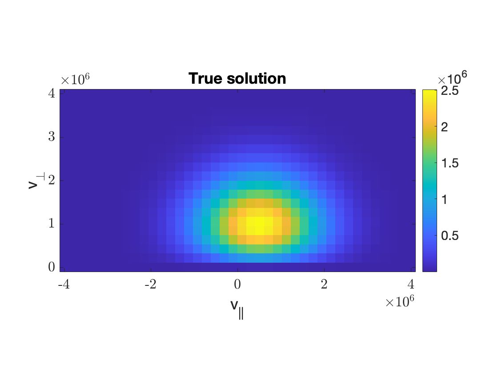
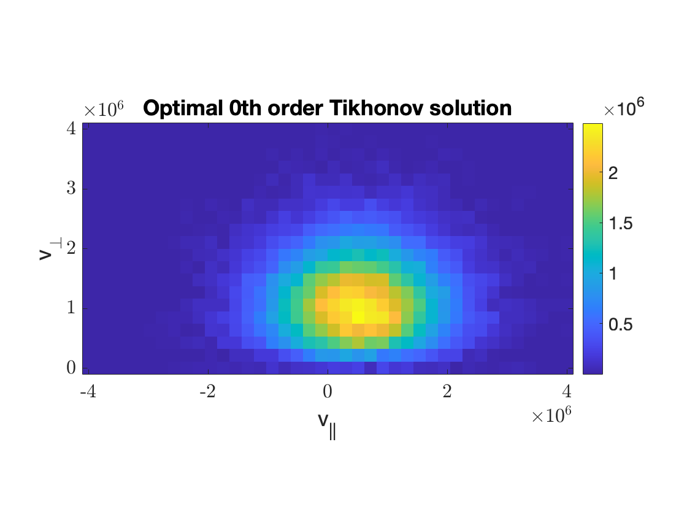

Examples
========

Tikhonov reconstructions for a bi-Maxwellian distribution
-----------------------------------------------------------
In this example, we will reconstruct the bi-Maxwellian fast-ion velocity distribution using the 0th order and 1st order 
regularisation matrix. This example is identical to ``demos/biMax_recon.m``.

.. code-block:: Matlab

   %% Bi-Maxwellian Reconstruction Example
   % This is a demo of a velocity-tomography example, where 
   % we reconstruct the bi-Maxwellian fast-ion velocity distribution
   % with the 0th and 1st order Tikhonov formulation.

   clear, clc, close all

   [A, b, x, L, ginfo] = biMax();

Now using the function ``showDistribution`` we can display the true solution and the least-squares solution, which we get by setting 
:math:`\alpha = 0`.

.. code-block:: Matlab

   %Display the true solution
   figure
   showDistribution(x,ginfo); title('True solution')

.. code-block:: Matlab

   %Display nonnegative least-squares solution
   figure
   showDistribution(TikhNN(A,b,0,[]),ginfo); title('NNLS solution')

.. code-block:: Matlab

   %0th order Tikhonov.
   disp('Solving 0th order Tikhonov.')
   alpha0 = logspace(-15,-8,20);
   xalpha0 = TikhNN(A, b, alpha0, []);
   [ralpha0, idx0] = relerr(x, xalpha0);
   fprintf('Optimal solution: alpha = %.2e, r(alpha) = %.5f\n',alpha0(idx0),ralpha0(idx0))

   figure; 
   semilogx(alpha0, ralpha0); xlabel('\alpha'); ylabel('Relative error')
   hold on
   plot(alpha0(idx0),ralpha0(idx0), '.', 'MarkerSize',15); ylim([0 max(ralpha0)])
   title('Relative error, 0th order Tikhonov')

   figure
   showDistribution(xalpha0(:,idx0),ginfo); title('Optimal 0th order Tikhonov solution')

For the 0th order Tikhonov, this gives us the following plot of the relative error as a funciton of the regularisation parameter :math:`\alpha`.

with the optimal regularisation parameter :math:`\alpha = 1.44\cdot10^{-10}` and minimum relative error :math:`0.06522`. Once again, we can use ``showDistribution`` 
to display the optimal 0th order solution.

For the 1st order Tikhonov, we pass the regularisation matrix *L* to ``TikhNN`` in order to penalize large norms in the 1st order derivative. 

.. code-block:: Matlab

   %1st order Tikhonov.
   disp('Solving 1st order Tikhonov.')
   alpha1 = logspace(-4,4,20); 
   xalpha1 = TikhNN(A, b, alpha1, L);
   [ralpha1, idx1] = relerr(x, xalpha1);
   fprintf('Optimal solution: alpha = %.2e, r(alpha) = %.5f\n',alpha1(idx1),ralpha1(idx1))

   figure; 
   semilogx(alpha1, ralpha1); xlabel('\alpha'); ylabel('Relative error')
   hold on
   plot(alpha1(idx1),ralpha1(idx1), '.', 'MarkerSize',15); ylim([0 max(ralpha1)])
   title('Relative error, 1st order Tikhonov')

   figure
   showDistribution(xalpha1(:,idx1),ginfo); title('Optimal 1st order Tikhonov solution')

By executing the code above, we get the following results:

For the 1st order Tikhonov solution, the optimal regularisation parameter :math:`\alpha = 1.13\cdot10^1` and minimum relative error of :math:`0.04030`. 

.. image:: images/biMax_1_opt.png
   :width: 800
   :align: center

This demo can be found in ``demos/biMax_recon.m`` and likewise, if you wish to conduct the same experiment with the slowing-down velocity distribution,
then you can take a look at ``demos/isoSD_recon.m``

Uncertainty Quantification for a bi-Maxwellian distribution 
-----------------------------------------------------------

First, the 0th and 1st order Tikhonov example is run just like before. This is such that we have something to compare with. 

.. code-block:: Matlab
  
   %% Bi-Maxwellian UQ Example
   % This is a demo of Uncertainty Quantification for the bi-Maxwellian
   % fast-ion velocity distribution. 

   clear, clc, close all

   [A, b, x, L, ginfo] = biMax();

   %Display the true solution
   figure
   showDistribution(x,ginfo); title('True solution')

   %Display nonnegative least-squares solution
   figure
   showDistribution(TikhNN(A,b,0,[]),ginfo); title('NNLS solution')

   %0th order Tikhonov.
   disp('Solving 0th order Tikhonov.')
   alpha0 = logspace(-15,-8,20);
   xalpha0 = TikhNN(A, b, alpha0, []);
   [ralpha0, idx0] = relerr(x, xalpha0);
   fprintf('Optimal solution: alpha = %.2e, r(alpha) = %.5f\n',alpha0(idx0),ralpha0(idx0))

   %1st order Tikhonov.
   disp('Solving 1st order Tikhonov.')
   alpha1 = logspace(-4,4,20); 
   xalpha1 = TikhNN(A, b, alpha1, L);
   [ralpha1, idx1] = relerr(x, xalpha1);
   fprintf('Optimal solution: alpha = %.2e, r(alpha) = %.5f\n',alpha1(idx1),ralpha1(idx1))

Now, we get on to the uncertainty quantification. Here, we do n = 1000 samples and discard 100 as burn-in. In order to make sure that the chains are 
stationary, this is not enough, but seeing as this is a demonstration it will do. 

.. code-block:: Matlab
   
   nsim = 1000; nburnin = 100;

   disp('Running Gibbs Sampler with 0th order prior - this might take a while.')
   [xsim0, alphasim0, deltasim0, lambdasim0, info0] = NNHGS(A,b,[],nsim);

   disp('Running Gibbs Sampler with 1st order prior - this might take a while.')
   [xsim1, alphasim1, deltasim1, lambdasim1, info1] = NNHGS(A,b,L,nsim);

Here, ``xsim`` contains the samples, ``alphasim``, ``deltasim`` and ``lambdasim`` contains the :math:`(\alpha, \delta, \lambda)`-chains, where
:math:`\alpha := \frac{\delta}{\lambda}`. After this, we can do some convergence analysis and look at the results. 

.. code-block:: Matlab
  
   %Convergence plots for 0th order
   disp('0th order:')
   chain_analysis(deltasim0(nburnin:end),lambdasim0(nburnin:end))

   %Convergence plots for 1st order
   disp('1st order:')
   chain_analysis(deltasim1(nburnin:end),lambdasim1(nburnin:end))

   %Plot the regularisation parameters with sample quantiles
   %0th order
   figure
   semilogx(alpha0, ralpha0)
   hold on
   plot(alpha0(idx0),ralpha0(idx0),'k.', 'MarkerSize', 15) %Optimum
   alpha0_mean = mean(alphasim0(nburnin:end)); r0mean = relerr(x,TikhNN(A,b,alpha0_mean));
   plot(alpha0_mean, r0mean, 'ro', 'MarkerSize', 10)
   qalpha0 = quantile(alphasim0(nburnin:end),[0.025, 0.975]);
   errorbar(alpha0_mean, r0mean, ...
            qalpha0(1) - alpha0_mean, ...
            qalpha0(2) - alpha0_mean, ...
            'horizontal','LineWidth',1,'color','r', 'HandleVisibility', 'off')
   title('0th order regularisation parameter results')

   figure
   semilogx(alpha1, ralpha1)
   hold on
   plot(alpha1(idx1),ralpha1(idx1),'k.', 'MarkerSize', 15) %Optimum
   alpha1_mean = mean(alphasim1(nburnin:end)); r1mean = relerr(x,TikhNN(A,b,alpha1_mean,L));
   plot(alpha1_mean, r1mean, 'ro', 'MarkerSize', 10)
   qalpha1 = quantile(alphasim1(nburnin:end),[0.025, 0.975]);
   errorbar(alpha1_mean, r1mean, ...
            qalpha1(1) - alpha1_mean, ...
            qalpha1(2) - alpha1_mean, ...
            'horizontal','LineWidth',1,'color','r', 'HandleVisibility', 'off')
   title('1st order regularisation parameter results')

   %Plot the credibility bounds
   figure
   subplot(1,2,1)
   showDistribution(mean(xsim0(:,nburnin:end),2),ginfo); title('Sample mean, 0th order prior')
   subplot(1,2,2)
   showDistribution(cbounds(xsim0(:,nburnin:end)),ginfo); title('95% credibility bounds, 0th order prior')

   figure
   subplot(1,2,1)
   showDistribution(mean(xsim1(:,nburnin:end),2),ginfo); title('Sample mean, 1st order prior')
   subplot(1,2,2)
   showDistribution(cbounds(xsim1(:,nburnin:end)),ginfo); title('95% credibility bounds, 1st order prior')

The demo can also be found in ``demos/biMax_UQ.m``, and a similar example with the slowing-down distribution can be found in ``demos/isoSD_UQ.m``
